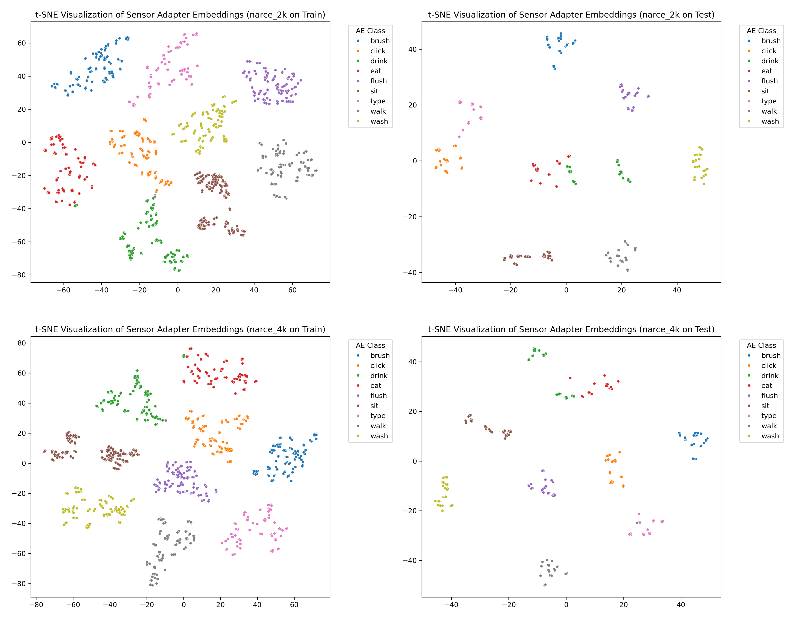
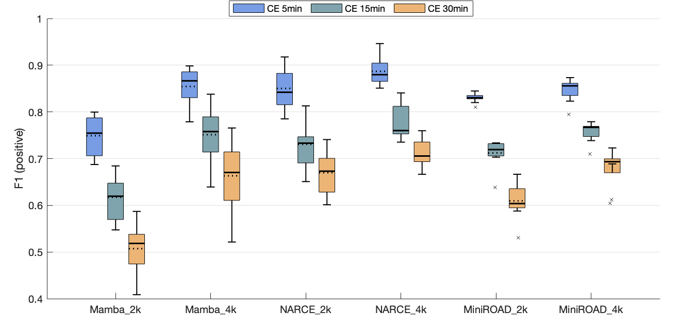

## AE Emergence Behavior Analysis

**Figure R5.** t-SNE visualization of the latent embedding produced by the Sensor Adapter of *NARCE_2k* (NARCE trained with 2k annotated CE sensor data) and *NARCE_4k* (NARCE trained with 4k annotated CE sensor data) on Train and Test sets. Points are colored by Atomic Event (AE) ground truth classes. Clear separation of classes indicates the emergence of AE-level structure despite no explicit AE supervision during training.

**Table R3** Quantitative analysis of Atomic Event (AE) emergence in Sensor Adapter embeddings, evaluated across *NARCE_2k* and *NARCE_4k* on Train and Test sets. We report Adjusted Rand Index (ARI), Normalized Mutual Information (NMI), and linear probe accuracy. High scores across all metrics indicate that the Sensor Adapter effectively encodes AE-level structure in its latent space, despite no explicit AE supervision. Notably, the model trained with more annotated CE sensor data (*NARCE_4k*) achieves higher performance, demonstrating better generalization, especially on unseen test data.

| Model    | Dataset   |   ARI |   NMI |   Linear Probe Accuracy |
|:---------|:----------|------:|------:|-----------------------:|
| narce_2k | Train     | 0.976 | 0.977 |                  0.994 |
| narce_2k | Test      | 0.9   | 0.935 |                  0.956 |
| narce_4k | Train     | 0.985 | 0.985 |                  0.997 |
| narce_4k | Test      | 0.903 | 0.943 |                  0.967 |

--- 
## Comparing NARCE with OAD Baseline

**Table R4.** Positive-class F1 scores with a 2-sigma confidence interval for NARCE, Mamba, and MiniROAD (a top-performing OAD baseline), evaluated on 5-minute and OOD test sets containing longer CE temporal patterns. We report the averaged result of each model using 10 random seeds. Bold values indicate the best-performing model within each sensor training data size configuration. Note that the MiniROAD has a similar model size with others, and the codes and architecture details can be found [here](https://anonymous.4open.science/r/icml2025-narce-rebuttal-6BD2/MiniROAD/main_ced.py).

| Sensor Data Size | NAR Data Size | Model     | 5 min         | 15 min         | 30 min         |
|-----------|-----------------|---------------|---------------|---------------|---------------|
| **2,000**            | 40,000        | NARCE (ours)   | **.85 ± .09** | **.73 ± .10**     | **.67 ± .09**     |
|          |     /    | Mamba | .75 ± .06     | .66 ± .13     | .51 ± .09     |
|       |    /    | MiniROAD | .83 ± .02     | .71 ± .06     | .61 ± .08   
| **4,000**            | 40,000        | NARCE (ours)    | **.89 ± .06** | **.77 ± .08**     | **.71 ± .06**     |
|           |    /    | Mamba | .85 ± .06     | .75 ± .13     | .66 ± .09     |
|           |   /     | MiniROAD | .85 ± .05 | .76 ± .04 | .68 ± .08  |

~
~

**Figure R6.** Boxplot visualization of the positive-class F1 scores for NARCE, Mamba, and MiniROAD, evaluated on 5-minute and OOD test sets containing longer CE temporal patterns. NARCE_4k outperforms MiniROAD_4k, and even NARCE_2k achieves competitive results compared to MiniROAD_4k. 
