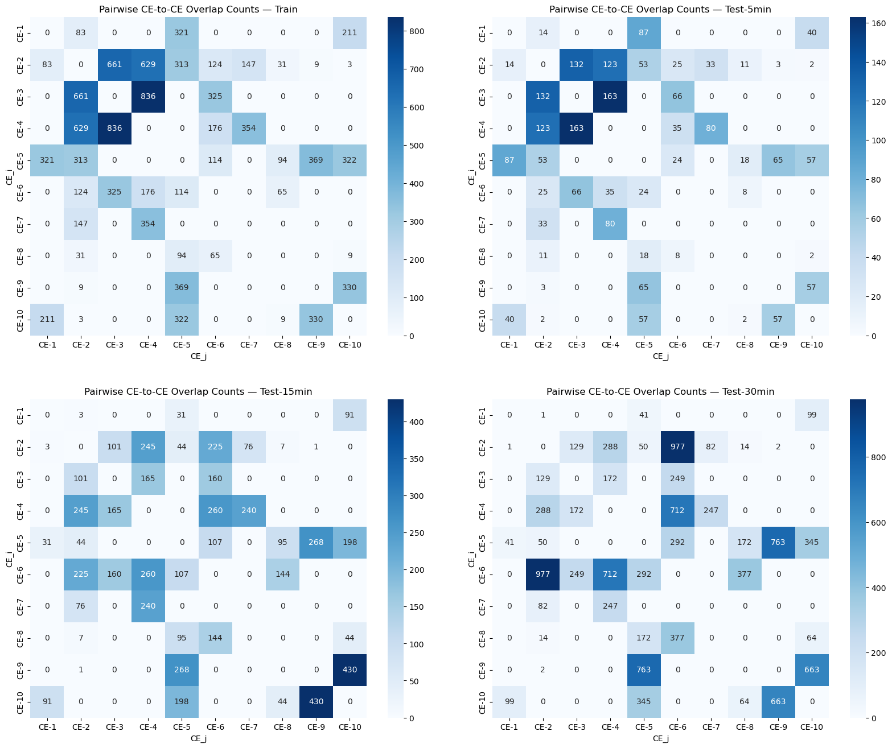

**Table R1.** *Percentage of samples in which each CE class appears at least once, across dataset splits (Train, Test-5min, Test-15min, Test-30min). The final column (“Only CE-0”) reports the proportion of samples that contain no positive complex events (CE-1 to CE-10).*

| Dataset      | CE-0 | CE-1  | CE-2  | CE-3  | CE-4  | CE-5  | CE-6  | CE-7  | CE-8  | CE-9  | CE-10  | Only CE-0  |
|--------------|------|-------|-------|-------|-------|-------|-------|-------|-------|-------|--------|------------|
| Train        | 100  | 16.5 | 27.9  | 19.5  | 10.8  | 18.8  | 20.8  | 13.8  | 7.3   | 10.5  | 13.9    | 9.1        |
| Test-5min    | 100  | 16.9 | 26.5  | 19.9  | 11    | 18.9  | 20.9  | 13.5  | 6.4   | 10.2  | 14.1    | 9.7        |
| Test-15min   | 100  | 10.2 | 24    | 14.7  | 20.2  | 13.0  | 62.9  | 18.7  | 16.7  | 28.9  | 40.3    | 1.4        |
| Test-30min   | 100  | 10.7 | 28.5  | 15.2  | 19.4  | 18.1  | 71.8  | 18.3  | 20.2  | 42.7  | 50.9    | 0.2        |

**Figure R1.** *Percentage of samples in which each CE class appears at least once, across dataset splits (Train, Test-5min, Test-15min, Test-30min). The rightmost bar (“Only CE-0”) indicates the percentage of samples that contain no positive complex event (CE-1 to CE-10), reflecting background-only cases.*

--- 

**Figure R2.** *Illustration of Online Complex Event Labeling Scheme and Overlapping CE Spans. The Online CE Labels row holds a 0 when no complex event is detected at that window, and a nonzero value k when the CE-k is recognized as complete at that point in time. Importantly, this labeling is sparse and instantaneous: each CE is labeled only at the completion time of its corresponding atomic event (AE) pattern. For instance, CE-3 is completed at timestamp 6, CE-4 at 10, and CE-1 at 13, but their related AE patterns span a much longer temporal duration (indicated by the arrows below). This illustration highlights how multiple CEs can overlap in their temporal spans but still produce non-overlapping online labels, reflecting the delayed and weak supervision setting of the Online CED task.*

---

**Figure R3.** *Distribution of the temporal span of each CE across datasets (Train, Test-5min, Test-15min, Test-30min). A CE's temporal span is defined as the temporal footprint of related AEs.*

---

**Table R2.**: *Overlap Statistics for Each CE Class. For each complex event (CE), we report 4 columns: (1) the percentage of samples in which it overlaps with any other CE, (2–3) the minimum and maximum number of distinct overlapping CE types in a single sample, and (4) the maximum total number of overlapping CE instances observed in a single sample.*

**Figure R4.** *Pairwise CE-to-CE overlap heatmaps across datasets (Train, Test-5min, Test-15min, Test-30min). Each cell CE_i, CE_j, $ i\neq j$, indicates how many samples contain at least one CE_i and CE_j whose temporal spans overlap. Stronger overlaps appear in darker shades.*
